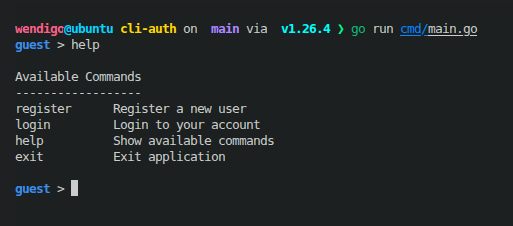
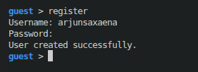
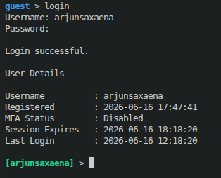
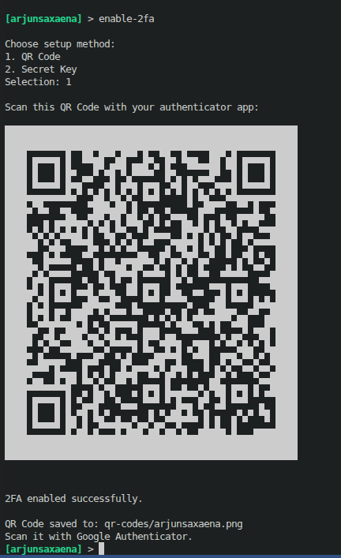
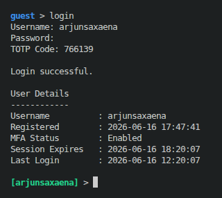
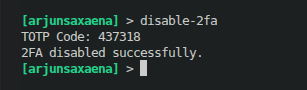

# Containerized CLI Login System with Optional 2FA

A secure, interactive command-line interface (CLI) registration and authentication system built in Go, supporting optional TOTP-based Multi-Factor Authentication (2FA), session expiration, and automatic account lockouts. The system persists data in a containerized SQLite database.

## 📌 Features

- **Robust Authentication**:
  - Secure registration & login.
  - Password hashing using `bcrypt`.
- **Optional 2FA**:
  - TOTP (Time-based One-Time Password) generation and validation compatible with Google Authenticator, Duo, etc.
  - Interactive setup: generate and save a QR Code (PNG) on the host machine or reveal the plain text secret key.
- **Account Lockout Policy**:
  - Locks accounts for a configurable duration after multiple failed login attempts.
  - Graceful lockout expiration: automatically resets failed attempts at the first login attempt after the lockout expires.
- **Session Management**:
  - Active session timeout tracking.
  - Dynamic shell prompts and autocompletion that update based on session status.
- **Interactive CLI**:
  - Auto-completion (tab-completion) for all valid state-specific commands.
  - Command history support.
  - State-specific command restrictions (cannot run guest commands when logged in and vice-versa).
  - Colorful status indicators.
- **Containerized Environment**:
  - Fully Dockerized setup with data persistence for databases and QR codes across restarts.

---

## 🛠 Tech Stack

- **Language**: Go (v1.25)
- **Database**: SQLite (built with `github.com/mattn/go-sqlite3`)
- **Interactive CLI**: `github.com/chzyer/readline`
- **TOTP/MFA**: `github.com/pquerna/otp`
- **QR Code**: `github.com/skip2/go-qrcode`
- **Containerization**: Docker & Docker Compose

---

## ⚙️ Configuration (Environment Variables)

You can customize the login system by modifying the environment variables under `services.cli-auth.environment` in `docker-compose.yml`:

| Environment Variable | Default Value | Description |
|---|---|---|
| `SESSION_TIMEOUT_MINUTES` | `30` | Minutes before an idle user session expires and requires logging back in. |
| `LOCK_DURATION_MINUTES` | `15` | Minutes an account remains locked after reaching max failed attempts. |
| `MAX_FAILED_ATTEMPTS` | `5` | Number of failed login attempts allowed before account lockout. |

---

## 🚀 How to Run

### Option 1: Run with Docker Compose (Recommended)

Make sure you have [Docker](https://docs.docker.com/get-docker/) installed.

1. **Build and start the container in interactive mode**:
   ```bash
   docker compose run --rm cli-auth
   ```
   *Note: Using `docker compose run` is required to attach your terminal input and support the interactive command prompt, tab-completion, and password masking.*

2. **Database and QR Code Persistence**:
   - The SQLite database is saved to `./data/cli-auth.db` on your host machine.
   - Any generated 2FA QR Codes are saved as PNG files under `./qr-codes/` on your host machine.

### Option 2: Run Locally (Without Docker)

You will need Go (v1.25+) installed and `gcc` to support sqlite3 CGO compilation.

1. **Run the CLI**:
   ```bash
   go run ./cmd/main.go
   ```

2. **Run the Unit Tests**:
   ```bash
   go test -v ./...
   ```

---

## 🎮 CLI Command Reference

The command-line interface changes its prompt and available commands dynamically based on whether you are logged in.

### 👤 Guest State (Prompt: `guest > `)

Before logging in, you have access to the following commands:
- **`register`**: Register a new account. You will be prompted to enter a username and password.
- **`login`**: Authenticate with your username and password. If 2FA is enabled for the account, it will prompt for the current 6-digit TOTP code.
- **`help`**: List all guest commands.
- **`exit`**: Terminate the CLI application.

### 🔐 Authenticated State (Prompt: `[username] > `)

After a successful login, the CLI displays your user details, changes color to green, and grants access to these commands:
- **`whoami`**: View details of the currently logged-in session (Username, Registration Date, MFA Status, Last Login Time, and Session Expiration Time).
- **`enable-2fa`**: Enable TOTP multi-factor authentication. You can choose to:
  1. Generate a QR Code saved to the `./qr-codes` directory.
  2. Display the raw Secret Key.
- **`disable-2fa`**: Turn off TOTP multi-factor authentication (requires verification using a 6-digit code).
- **`logout`**: End the current active session and return to the Guest state.
- **`help`**: List all authenticated commands.
- **`exit`**: Terminate the application.

---

## 🔒 Security & Verification Details

1. **Password Protection**: Passwords are never stored in plaintext. They are hashed using `bcrypt` and verified using secure constant-time comparisons.
2. **Account Lockouts**: If a user exceeds `MAX_FAILED_ATTEMPTS` failed logins, their database record is marked with a timestamp in `locked_until`. Any subsequent login attempts during this duration are rejected immediately with the lockout message.
3. **Session Expiry**: Sessions expire automatically after `SESSION_TIMEOUT_MINUTES`. If you run any command after this duration has passed, the CLI informs you that your session has expired, cleans the login state, and returns you to the guest state.

---

## 📸 Visual Walkthrough

### 1. Help Commands


### 2. User Registration


### 3. User Login


### 4. Enable 2FA


### 5. Login with 2FA


### 6. Disable 2FA
